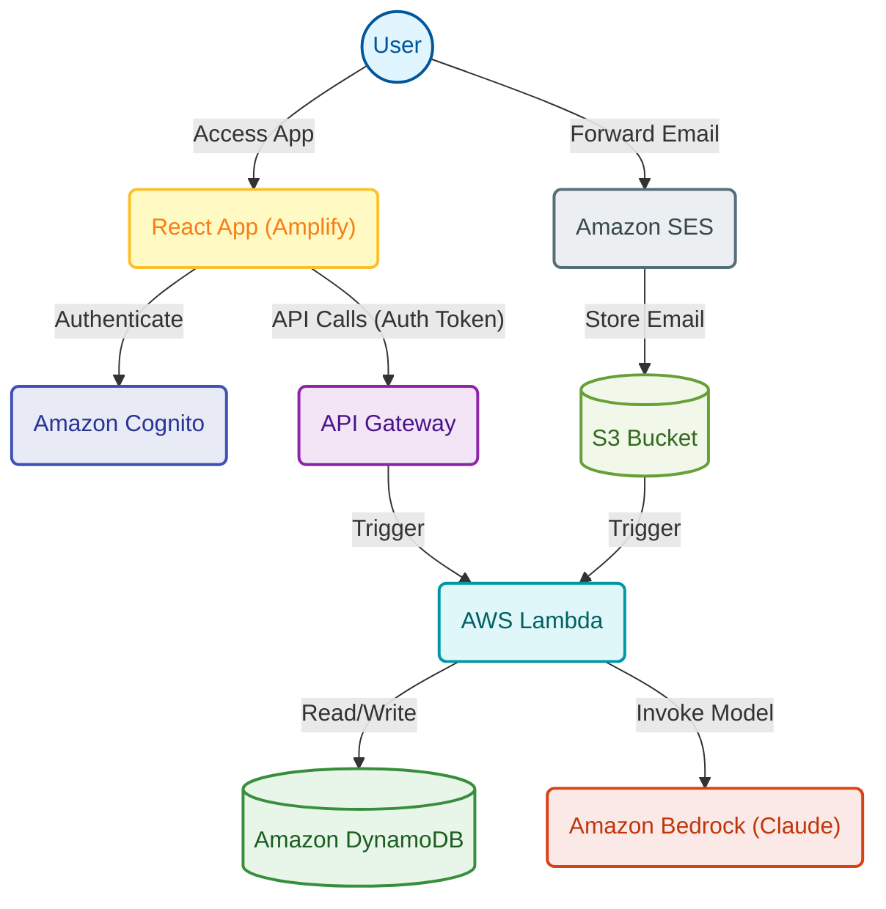

<div align="center">
  

# Ghost Sub Tracker

  **Real-time surveillance of your subscriptions**

  [](https://ghost-sub-tracker.vercel.app/)
  [](https://reactjs.org/)
  [](https://opensource.org/licenses/MIT)

</div>

---

## About

Ghost Sub Tracker is a modern web application that helps you take control of your subscription services. Never miss a renewal date or lose track of how much you're spending on monthly subscriptions again. With an intuitive dashboard and real-time tracking, managing your subscriptions has never been easier.

Whether you're tracking Netflix, Spotify, gym memberships, or any other recurring payment, Ghost Sub Tracker gives you a centralized place to monitor everything at a glance.

**Perfect for:**

- Individuals managing multiple subscription services
- Families tracking shared subscriptions
- Anyone looking to optimize their monthly spending
- Budget-conscious users who want visibility into recurring costs

## Features

- **Centralized Dashboard** - View all your subscriptions in one place with a clean, organized interface
- **Real-Time Monthly Spend Tracking** - Automatically calculates your total monthly subscription costs
- **Multi-Currency Support** - Track subscriptions in 12+ currencies including USD, EUR, GBP, JPY, CAD, AUD, CHF, CNY, INR, BRL, MXN, and SGD
- **Easy Management** - Add, edit, and update subscription details with intuitive modal forms
- **Renewal Date Tracking** - Never miss a renewal date with clear next billing date display
- **Secure Authentication** - Sign in securely with your Google account or create a dedicated account via AWS Cognito
- **Email Auto-Forwarding** - Optionally forward subscription receipts for automatic tracking
- **Modern Dark Interface** - Beautiful, eye-friendly dark mode design
- **Fully Responsive** - Works seamlessly on desktop, tablet, and mobile devices
- **Fast & Reliable** - Built with React 19 and deployed on Vercel for lightning-fast performance

## Screenshots

*Screenshots coming soon - check out the [live demo](https://ghost-sub-tracker.vercel.app/) to see it in action!*

## Live Demo

Try it out now: **[ghost-sub-tracker.vercel.app](https://ghost-sub-tracker.vercel.app/)**

Sign up with your Google account or create a new account to start tracking your subscriptions immediately.

---

# Developer Documentation

## Architecture Diagram



## Tech Stack

**Frontend:**

- React 19.2.3
- React Scripts 5.0.1 (Create React App)
- Tailwind CSS 3.4.0
- shadcn/ui component library
- Lucide React (icons)

**Authentication & Backend:**

- AWS Amplify 6.15.9
- AWS Amplify UI React 6.13.2
- AWS Cognito (OAuth with Google)
- API Gateway (REST API)

**Styling:**

- Tailwind CSS with custom theme
- Class Variance Authority (component variants)
- Tailwind Merge & Tailwind CSS Animate

**Deployment:**

- Vercel (primary)
- AWS Amplify Hosting (alternative)

## Prerequisites

Before you begin, ensure you have the following installed:

- Node.js (version 16.x or higher recommended)
- npm or yarn package manager
- AWS Account with Cognito User Pool configured
- API Gateway endpoint for backend subscriptions API

## Getting Started

### Installation

1. Clone the repository:

```bash
git clone https://github.com/[your-username]/ghost-sub-tracker.git
cd ghost-sub-tracker
```

2. Install dependencies:

```bash
npm install
```

3. Create a `.env` file in the root directory:

```env
REACT_APP_API_URL=your_api_gateway_url_here
REACT_APP_COGNITO_USER_POOL_ID=your_cognito_user_pool_id
REACT_APP_COGNITO_USER_POOL_CLIENT_ID=your_cognito_client_id
REACT_APP_COGNITO_DOMAIN=your_cognito_domain
```

**Note:** If environment variables are not provided, the app will use default values configured in `src/App.js` (suitable for the production deployment).

4. Start the development server:

```bash
npm start
```

The app will open at [http://localhost:3000](http://localhost:3000)

### Available Scripts

In the project directory, you can run:

#### `npm start`

Runs the app in development mode. Open [http://localhost:3000](http://localhost:3000) to view it in your browser. The page will reload when you make changes.

#### `npm test`

Launches the test runner in interactive watch mode.

#### `npm run build`

Builds the app for production to the `build` folder. It correctly bundles React in production mode and optimizes the build for the best performance.

#### `npm run eject`

**Note: this is a one-way operation. Once you eject, you can't go back!**

If you need full control over the build configuration, you can eject from Create React App.

## Project Structure

```
ghost-sub-tracker/
├── public/                      # Static assets
│   ├── favicon-*.png           # Favicons (multiple sizes)
│   ├── logo512.png             # App logo
│   ├── manifest.json           # PWA manifest
│   └── index.html              # HTML entry point
├── src/
│   ├── components/             # React components
│   │   ├── Dashboard.jsx       # Main dashboard view
│   │   ├── AddSubscription.jsx # Add subscription modal
│   │   ├── EditSubscription.jsx# Edit subscription modal
│   │   ├── SetupWizard.jsx    # Email setup instructions
│   │   └── ui/                 # Reusable shadcn/ui components
│   │       ├── button.jsx
│   │       ├── card.jsx
│   │       ├── badge.jsx
│   │       ├── dialog.jsx
│   │       ├── table.jsx
│   │       └── skeleton.jsx
│   ├── contexts/               # React Context providers
│   │   └── CurrencyContext.js  # Global currency state
│   ├── lib/                    # Utility functions
│   │   └── utils.js            # Helper utilities
│   ├── App.js                  # Main app component & Cognito config
│   ├── index.js                # React DOM render entry point
│   └── index.css               # Global styles & Tailwind imports
├── .gitignore                  # Git ignore rules
├── package.json                # Dependencies & scripts
├── tailwind.config.js          # Tailwind CSS configuration
├── components.json             # shadcn/ui configuration
├── amplify.yml                 # AWS Amplify deployment config
└── README.md                   # This file
```

## Deployment

### Deploy to Vercel (Recommended)

1. Push your code to a GitHub repository
2. Visit [vercel.com](https://vercel.com) and import your repository
3. Configure environment variables in the Vercel dashboard:
   - `REACT_APP_API_URL`
   - `REACT_APP_COGNITO_USER_POOL_ID`
   - `REACT_APP_COGNITO_USER_POOL_CLIENT_ID`
   - `REACT_APP_COGNITO_DOMAIN`
4. Deploy! Vercel will automatically build and deploy your app

Vercel will automatically redeploy when you push changes to your main branch.

### Deploy to AWS Amplify

1. Connect your GitHub repository to AWS Amplify Console
2. Amplify will automatically detect the `amplify.yml` configuration
3. Add environment variables in the Amplify Console under App Settings > Environment Variables
4. Save and deploy

The `amplify.yml` file is already configured with the correct build settings.

## Configuration

### AWS Cognito Setup

To run your own instance, you'll need to configure AWS Cognito:

1. Create a Cognito User Pool in AWS Console
2. Configure OAuth settings:
   - Add your callback URLs (e.g., `http://localhost:3000/` and your production URL)
   - Enable Google as an identity provider (optional)
   - Set OAuth scopes: `openid`, `email`, `profile`
3. Note your User Pool ID, Client ID, and Cognito Domain
4. Add these values to your `.env` file

**Important:** The Cognito User Pool ID, Client ID, and Domain are meant to be public in client-side applications. Security is enforced through backend token validation, not by keeping these values secret. See [AWS Cognito documentation](https://docs.aws.amazon.com/cognito/latest/developerguide/user-pool-settings-client-apps.html) for more details.

### API Gateway Setup

The backend API should expose the following endpoints:

- **GET** `/subscriptions` - Fetch all subscriptions for the authenticated user
- **POST** `/subscriptions` - Create a new subscription
- **PUT** `/subscriptions` - Update an existing subscription

**Authentication:**

- All requests must include the Cognito ID Token in the `Authorization` header
- Configure a Lambda Authorizer in API Gateway to validate the ID Token
- CORS must be enabled for your frontend domain

**Expected Response Format:**

```json
{
  "message": "Success",
  "item": {
    "original_msg_id": "string",
    "merchant": "string",
    "cost": number,
    "renewal_date": "string",
    "status": "Active" | "Cancelled" | "Paused" | "Expired",
    "user_id": "string"
  }
}
```

## Contributing

Contributions are welcome! Please follow these steps:

1. Fork the repository
2. Create a new branch: `git checkout -b feature/your-feature-name`
3. Make your changes and commit: `git commit -m 'Add some feature'`
4. Push to your branch: `git push origin feature/your-feature-name`
5. Open a Pull Request

Please ensure your code follows the existing style and includes appropriate tests.

## Security

- **Cognito Credentials:** The User Pool ID, Client ID, and Domain in the source code are intentionally public. This is standard practice for client-side OAuth applications.
- **Authentication:** All API requests are authenticated using Cognito ID Tokens, which are validated by the backend.
- **Environment Variables:** Never commit your `.env` file. The `.gitignore` is configured to exclude it.
- **API Security:** The backend API Gateway validates all requests through a Lambda Authorizer before processing.

## License

This project is licensed under the MIT License. This means you are free to use, modify, and distribute this software, even for commercial purposes, as long as you include the original copyright notice.

To add a license file, create a `LICENSE` file in the root directory with the MIT License text.

## Support

- **Issues:** Found a bug or have a feature request? [Open an issue](https://github.com/[your-username]/ghost-sub-tracker/issues)
- **Discussions:** Have questions or want to discuss features? Use GitHub Discussions

---

<div align="center">
  Made with ❤️ for better subscription management

  [Live Demo](https://ghost-sub-tracker.vercel.app/) • [Report Bug](https://github.com/[your-username]/ghost-sub-tracker/issues) • [Request Feature](https://github.com/[your-username]/ghost-sub-tracker/issues)

</div>
